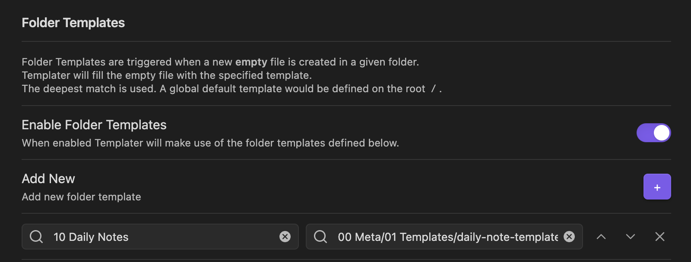

If your daily notes template has [links to yesterday's and tomorrow's](/snippets/templater#daily-note-links-to-yesterday-and-tomorrow) daily notes, then it's possible you've run into the issue where clicking on a date in the [Calendar](obsidian://show-plugin?id=calendar) plugin will apply your template, but clicking on links to yesterday's and tomorrow's notes will not apply your template.

If this is the case, you can solve this with the [folder templates](https://silentvoid13.github.io/Templater/settings.html#folder-templates) feature of the [Templater](obsidian://show-plugin?id=templater-obsidian) plugin.

## Turn on folder templates

In Templater settings, setup the following settings.

- "Trigger Templater on new file creation" toggled on.
- "Enable folder templates" toggled on.
- Add new folder template(s).
  - Add your folder template here. The left input is where you'll set the folder where you want the template to be applied. The right input is for the template that will be applied to new notes in that folder.

Here's what my folder template settings look like.

## Other potential settings to change

If the above doesn't work, try adjusting the following settings.

- Clear the "Template file location" setting for the Daily Notes plugin.
- Disable the Templates core plugin. This plugin could potentially conflict with the Templater community plugin.

## Conclusion

And that's it! You should now be able to click on links to yesterday's and tomorrow's daily notes and have your daily notes template applied.
